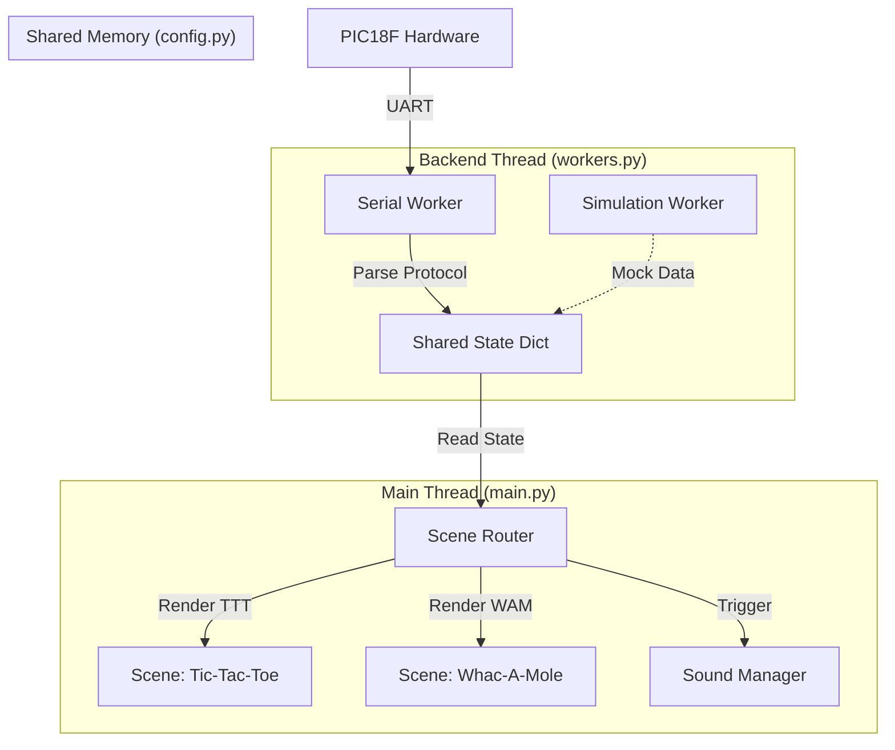

# PC UI System Architecture Document

## 1. System Overview

The system adopts a **Producer-Consumer** architecture. By utilizing **Multi-threading**, it decouples Hardware Communication from Graphics Rendering. This ensures the interface remains fluid (60 FPS) even under high data loads or waiting periods for serial data.

### Core Design Patterns

- **Producer-Consumer Pattern**: The background thread (Worker) produces data from the microcontroller, and the main thread (UI) consumes this data to update the screen. This is the specific implementation of **Multi-threading** in this project.
- **State Machine**: The UI switches between different game screens (scenes) based on the `scene` variable received from the protocol.
- **Singleton Pattern**: The `Shared State` acts as the single source of truth for data exchange across threads.

## 2. File Structure and Responsibilities

The system is organized into 5 main modules:

| Filename | Type | Core Responsibility |
| --- | --- | --- |
| **`main.py`** | Entry Point | Parses CLI arguments, initializes the system, spawns threads, and runs the main Pygame loop. |
| **`config.py`** | Configuration | Stores global settings (Port, Baudrate, Colors) and the thread-safe `shared_state`. |
| **`workers.py`** | Backend Logic | **(Producer)** Handles UART serial reading or executes the simulation script. Updates the shared state with parsed data. |
| **`scenes.py`** | Rendering | **(Consumer)** Contains rendering logic for all screens, including 2.5D projection calculations and HUD design. |
| **`managers.py`** | Logic/Utility | Contains auxiliary subsystems: `SoundManager` (Audio), `DataManager` (CSV Logging), `BackgroundEffect` (VFX). |

## 3. Data Flow Architecture

## 4. Key Technical Details

### 4.1 Protocol Handling

- **Format**: `$<HEADER>,<DATA...>*` (CSV format).
- **Error Handling**: Parsing logic is wrapped in `try-except` blocks to prevent UI crashes due to serial noise or malformed packets.

### 4.2 Visual Effects System

- **BackgroundEffect**:
    - Implements a **3D Perspective Grid** algorithm to create depth.
    - Includes a particle system and dynamic shooting stars.
- **Whac-A-Mole 3D Rendering**:
    - Uses 2.5D projection techniques to draw holes and moles with depth.
    - Implements dynamic lighting and impact shockwave effects.

### 4.3 Audio Management

- The `SoundManager` maintains an internal **State Cache**.
- `play()` is only triggered when `Current_State != Last_State` (State Transition).

## 5. Extensibility

To add a fourth game:

1. Define a new Scene ID in `config.py`.
2. Add corresponding mock data logic in `workers.py`.
3. Create a `scene_newgame()` rendering function in `scenes.py`.
4. Add a new `elif` branch in the routing logic within `main.py`.

*Document Generated: 2025-12-12*